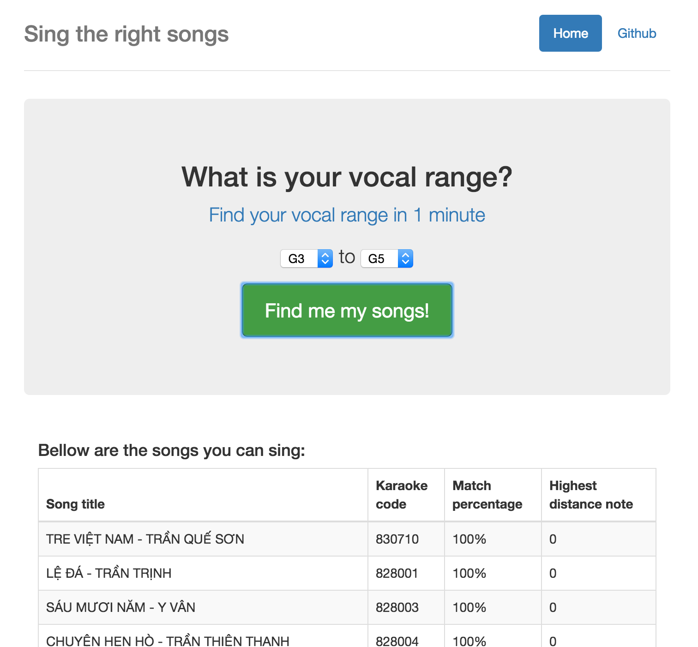

# sing-the-right-songs
This application help you find the songs you **can sing with your vocal range**!

# What it looks like

# Story
Everyone has their own vocal range, how do they now if a song is in the range so they can perform it perfectly? This application will help.

Basically, this app searchs for all the songs from MIDI files, and then compare with user vocal range to list out the most capible songs for user.

The MIDI song database is not in this repository because it is about 200MB, generated note value is placed at `songs.json`. (Only Vietnamese songs)
